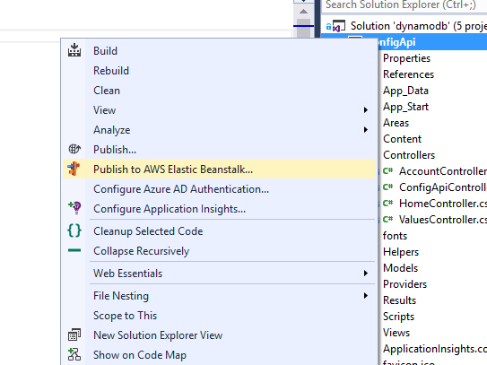
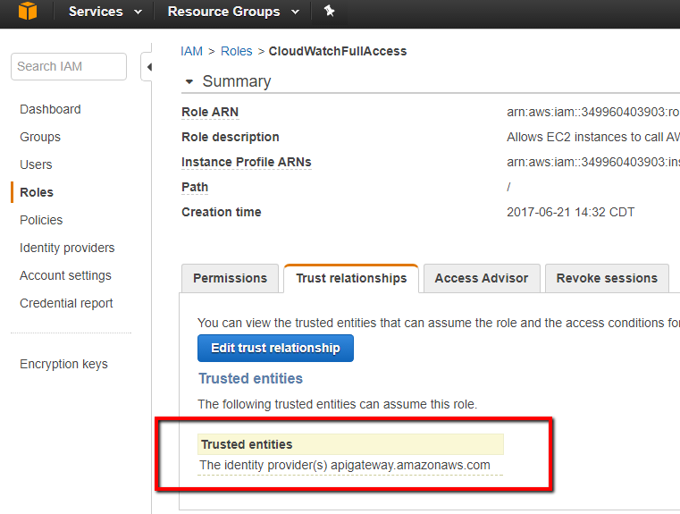

# General .Net SDK - LOGGING
The goal is to be able to write logs somewhere.  I found how to get the logging to go to AWS CloudWatch.  In the Participation example, 
* NLog.LogManager.GetLogger("aws").Info("message") writes to a CloudWatch Log LogStream.
** I reached succed on this by following https://github.com/aws/aws-logging-dotnet/blob/master/samples/NLog/ProgrammaticConfigurationExample/Program.cs
* ApiGateway requests are also logged to a CloludWatch LogStream, and can have the complete Request with headers and Body

## NuGet Packages


The CloadWatch Logs are created in 


## Code Excerpts
````Configuring NLog
        static void ConfigureNLog()
        {
            var config = new LoggingConfiguration();

            var consoleTarget = new ColoredConsoleTarget();
            config.AddTarget("console", consoleTarget);

            var awsTarget = new NLog.AWS.Logger.AWSTarget()
            {
                LogGroup = "NLog.ProgrammaticConfigurationExample",
                Region = "us-east-2"
            };
            config.AddTarget("aws", awsTarget);

            config.LoggingRules.Add(new LoggingRule("*", LogLevel.Debug, consoleTarget));
            config.LoggingRules.Add(new LoggingRule("*", LogLevel.Debug, awsTarget));

            LogManager.Configuration = config;
        }
````

```` Confirmation POST Body Payload
    public class ConfirmationMessage
    {
        public string Type { get; set; }
        public Guid MessageId { get; set; }
        public string Token { get; set; }
        public string TopicArn { get; set; }
        public string Message { get; set; }
        public string SubscribeURL { get; set; }

    }
````


[Logging](https://aws.amazon.com/blogs/developer/logging-with-the-aws-sdk-for-net/)

https://aws.amazon.com/blogs/developer/amazon-cloudwatch-logs-and-net-logging-frameworks/

* https://github.com/aws/aws-logging-dotnet

Following the NLog example, I had a failure with the Configured example based on NLog.config.  By catching exceptions in the ApiController and returning as
````
  return BadRequest(ex.ToString());
````
I was able to determine the configuration wasn't finding the target "AWSTarget"

I then switch to use the programmatic configuration.  With the same "BadRequest" I was able to determine that "AWS.Logger.Core" wasn't found during app start=up, I had to include that NuGet.  See: https://github.com/aws/aws-logging-dotnet/blob/master/samples/NLog/ProgrammaticConfigurationExample/Program.cs

I also found that I needed permissions on the EC2 Role to Create Cloud Watch Log Group and Stream. The EC2 already has a CloudWatch Logs Agent, but I am trying to write via the Cloudwatch Logs SDK, so the policy described on this link explains the permissions needed for the EC2 Role.  I applied this to both roles aws-elasticbeanstalk-ec2-role and aws-beanstalk-service-role. See: https://docs.aws.amazon.com/AmazonCloudWatch/latest/logs/QuickStartEC2Instance.html


### The Logs in CloudWatch Look Like This


# Publishing Web Api to Beanstalk
* Optionally create a Beanstalk App using the wizard.  But when I get to the choice of Creating a Sample APp or Uploading an App, I'm not sure what to do.  If I stop here, the App is created, but it has no environment.  
* The way I did it was to use the Visual Studio Context-Menu as in these screenshots:




## API Gateway
To get ApiGateway confogured to log full requests to CloudWatch, I had to add Policies and Trust Relationship.  See https://aws.amazon.com/premiumsupport/knowledge-center/api-gateway-cloudwatch-logs/   See also: https://forums.aws.amazon.com/thread.jspa?threadID=219199





# DynamoDB Streams

[DynamoDB Update Triggers (Streams + Lambda) + Cross-Region Replication App](https://aws.amazon.com/blogs/aws/dynamodb-update-triggers-streams-lambda-cross-region-replication-app/)

[Capturing Table Activity with DynamoDB Streams](http://docs.aws.amazon.com/amazondynamodb/latest/developerguide/Streams.html)

# AWS Lambda SDK's
[Javascript SDK](http://docs.aws.amazon.com/AWSJavaScriptSDK/latest/AWS/S3.html)

[AWS CLI for Lambda](http://docs.aws.amazon.com/cli/latest/reference/lambda/index.html#available-commands)


# AWS Lambda Samples
[Use Cases - Examples of how to use Lambdas]
(http://docs.aws.amazon.com/lambda/latest/dg/use-cases.html)

[Mobile Back-end Android App and Lambda Function](http://docs.aws.amazon.com/lambda/latest/dg/with-on-demand-custom-android-example.html)

The folder [lanbdaf1](./lambdaf1) demonstrates [using Lambda functions with S3 Buckets](http://docs.aws.amazon.com/lambda/latest/dg/with-s3-example.html) based on capturing upload of a picture to an S3 bucket which triggers a Lambda Functions to Create a Thumbnail.  See the project [ReadMe](./lambdaf1/README.md).

[Step 4 of Tutorial Gets Into Serverless Deployment Packages](http://docs.aws.amazon.com/lambda/latest/dg/with-s3-example-use-app-spec.html)

[Deploying Lambda Based Applications](http://docs.aws.amazon.com/lambda/latest/dg/deploying-lambda-apps.html)
 -- [Github Resources for Deploying](https://github.com/awslabs/serverless-application-model/blob/master/versions/2016-10-31.md)

[Simple Microservice using Lambda and API Gateway](http://docs.aws.amazon.com/lambda/latest/dg/with-on-demand-https-example-configure-event-source_1.html)

[Simplified Serverless App Delpoyment and Management - Introduction article Oct 2016](https://aws.amazon.com/blogs/compute/introducing-simplified-serverless-application-deplyoment-and-management/)

[Github resources for Oct 2016 Article](https://github.com/awslabs/serverless-application-model/blob/master/examples/2016-10-31/s3_processor/template.yaml)

The folder [sam](./sam) is a work-through of [Create Your Own Serverless Application](http://docs.aws.amazon.com/lambda/latest/dg/serverless-deploy-wt.html) 

[Cloud Formations Docs](http://docs.aws.amazon.com/AWSCloudFormation/latest/UserGuide/Welcome.html)

The folder [dynamodb](./dynamodb) is a .Net Application prototype for a "Configuration Manager" which retrieves Application Settings from a Dynamo Table.  The Table must have a PartitionKey and a Sort (Range) Key.  Those keys are provided by a client, colloquially known as ProjectName and ConfigurationKey.  The app is deployed to EC2 by using beanstalk.  The [Console](https://us-east-2.console.aws.amazon.com/elasticbeanstalk/home?region=us-east-2#/applications) was created by following the Beanstalk wizard to create a .Net IIS Container.  It was deployed to by using the Visual Studio AWS Tools which provide a "Deploy to AWS" in the context menu of the Web Project in the VS Solution Tree.

[Creating a Beanstalk .Net App](http://docs.aws.amazon.com/elasticbeanstalk/latest/dg/create_deploy_NET.quickstart.html)

To deploy I used the step [Deploy](https://aws.amazon.com/blogs/developer/deploy-an-existing-asp-net-core-web-api-to-aws-lambda/), I didn't use the steps about configuring Servless or Lambda functions, just the "Deploy" step in the context menu of my Web App Project.

I would like to try this demo on [Serverless Application in Visual Studio](https://aws.amazon.com/blogs/developer/aws-serverless-applications-in-visual-studio/) sometime


# Beanstalk
[My First Elastic Beanstalk Application](https://us-west-2.console.aws.amazon.com/elasticbeanstalk/home?region=us-west-2#/application/versions?applicationName=My%20First%20Elastic%20Beanstalk%20Application)

[Creating and Deploying Beanstalk Apps](http://docs.aws.amazon.com/elasticbeanstalk/latest/dg/create_deploy_Java.html)


[IAM](https://console.aws.amazon.com/iam/home?region=us-west-2#/users)


http://docs.aws.amazon.com/AmazonS3/latest/API/sig-v4-examples-using-sdks.html

http://docs.aws.amazon.com/AmazonS3/latest/API/sig-v4-header-based-auth.html


